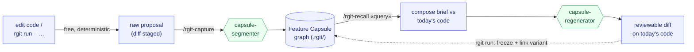

<h1 align="center">&nbsp;&nbsp;&nbsp;research-git</h1>

<p align="center">
  <strong>Reapply or remove previous experiments &amp; features safely on today’s code.</strong>
  <br />
  <em>Works with Claude Code, Codex, Gemini CLI, and opencode.</em>
</p>

<p align="center">
  <a href="#quick-start"></a>
  
  
  
  
</p>

<p align="center">
  
</p>

research-git is a new Git tool for researchers and developers, built for the agentic coding era.

It captures important experiments and feature decisions as reusable semantic units, so coding agents can reapply, adapt, or safely remove them on today’s codebase.

## Why research-git

AI coding tools can generate many different experiments and features in a day. But when you try to reintroduce a previously removed experiment just a few days later, the codebase may have changed so much that the experiment no longer fits the current infrastructure.

Traditional Git preserves commits and diffs, but it does not preserve the context behind them. It cannot tell an agent which changes belong to an experiment, why they were made, what assumptions they depended on, or what results they produced. Without that context, reverting may erase later work, replaying an old diff may fail against a changed architecture, and removing a feature may damage shared infrastructure.

research-git records experiments and feature decisions as reusable Capsules, capturing their intent, relevant code, dependencies, configuration, results, and restoration guidance. This gives coding agents the context to safely reapply or remove them on today’s codebase without restoring an old snapshot or deleting code piece by piece.

## Quick Start

### 1. Install

```bash
pip install research-git
rgit install                # wires research-git into every agent client on this machine
cd your-project
rgit init                   # creates the .rgit/ store in your repo
```

Installation takes less than 30 seconds. Restart your coding agent afterwards so it loads research-git.

<details>
<summary>Install details: choosing platforms, guidance modes, capture-on-commit</summary>

- `rgit install claude-code` (or `codex` / `gemini` / `opencode` / `generic`) targets one client; `--list` shows all; `--uninstall` removes.
- The installer also writes a short guidance block into your client's global file (`~/.claude/CLAUDE.md`, `~/.codex/AGENTS.md`, …) so the agent knows when to save ideas. On an interactive terminal you pick how proactive that should be (`default` / `manual-only` / `none`); pass `--guidance <mode>` to choose non-interactively.
- **Optional:** `rgit install-hooks` (per repo) makes every `git commit` stage its own snapshot automatically, so nothing slips through even when you forget. It never touches an existing hook, hooks never approve anything, and `rgit install-hooks --uninstall` removes it. Skip it in CI or shared clones.
- Manual route on Claude Code: `/plugin marketplace add StepzeroLab/research-git` then `/plugin install research-git@research-git`.

</details>

### 2. Working with an agent? Just talk to it

If your repository already has history, let your agent run the `rgit-digest` skill. It turns earlier work into Capsules, giving recall something to find from day one.

<p align="center">
  
</p>

After install your agent does the remembering. Work as usual. It saves each meaningful idea as a Feature Capsule and asks you before anything is kept. Weeks later, when the code has moved on, just ask:

<p align="center">
  
</p>

The agent finds the capsule and **re-implements the idea onto today's code**, leaving you a reviewable diff. There are no commands to memorize. If you like being explicit, `/rgit-capture` saves recent work and `/rgit-recall <what you want back>` brings an idea home.

<p align="center">
  
</p>

### 3. From the terminal

```bash
rgit run -- python eval_agent.py --retrieval rerank   # run an experiment; freezes a byte-exact snapshot + metrics
rgit review                                           # see what's been captured, approve what's worth keeping
rgit compare rerank                                   # which variant won?
```

`rgit capture` saves the current changes (or the last commit) when you're not using `rgit run`. Bringing an idea *back* needs an agent session because that's where the intelligence lives. From the terminal, you can always browse the memory with `rgit features` and `rgit graph`.

More commands as your store grows: [More commands](#more-commands).

> [!TIP]
> We publish a new research-git release for major updates. [Keep research-git updated](#updating).

## How it works

One loop: capture each idea into a graph, then regenerate it onto today's code. The engine (blue) is free and deterministic. Intelligence happens at exactly two points (green), where subagents run on your existing subscription without a paid API.

<p align="center">
  
</p>



<details>
<summary>Learn more (under the hood)</summary>

### Build the memory, borrow the agent

The engine owns the durable, deterministic parts: the graph, content-addressed object store, git diffing, and the byte-exact run freeze. The agentic parts are delegated to subagents the host already provides. We don't reimplement an agent loop, and we never call a paid API.

### Two-phase capture

A free, deterministic Phase 1 (`libcst` maps diff hunks to the functions/classes they touch) produces a rough candidate for every change. Phase 2 is a dispatched `capsule-segmenter` subagent that clusters the diff into coherent features, drops infrastructure noise, and writes the real intent, knobs, assumptions, and resurrection guide. Once a capsule is approved, the engine deterministically links same-region edges and over-produces `depends_on` candidates from name overlap, which an `edge-judge` subagent confirms or rejects.

### Ranked, edge-aware recall

Recall scores every approved capsule against your query in plain Python, without embeddings or SQL `LIKE` traps. It boosts a hit when a connected capsule also matches, so related work surfaces together. Each result carries its related subgraph.

### Two planes

- **MCP: shared memory (query-only).** Returns graph snippets; safe to expose so a team shares one memory. Carries no intelligence.
- **Plugin: local intelligence.** Three subagents (`capsule-segmenter`, `capsule-regenerator`, `edge-judge`) and two skills (`rgit-capture`, `rgit-recall`) define *how* a session acts on those snippets, natively, on its own subscription.

### Reproducibility contract

The agent helps you *author*; it is never in the *replay* path. `rgit run` freezes the exact bytes that ran, content-addressed and immutable. "The code behind run X" is a byte-identical re-materialization of a stored blob.

</details>

## What a Capsule Contains

Every idea you keep becomes a self-contained Capsule that a future agent can use to bring the idea back:

<table>
  <thead>
    <tr>
      <th width="24%">Field</th>
      <th>What it holds</th>
    </tr>
  </thead>
  <tbody>
    <tr>
      <td><strong>intent</strong></td>
      <td>Why this change existed: the hypothesis, not a restatement of the diff.</td>
    </tr>
    <tr>
      <td><strong>code slices</strong></td>
      <td>The relevant snippets, files, and symbols.</td>
    </tr>
    <tr>
      <td><strong>knobs</strong></td>
      <td>The parameters, flags, and configuration.</td>
    </tr>
    <tr>
      <td><strong>dependencies</strong></td>
      <td>The other Capsules it needs, including silent assumptions.</td>
    </tr>
    <tr>
      <td><strong>result</strong></td>
      <td>The metrics, notes, and reasons it worked or did not work, linked to the runs it produced.</td>
    </tr>
    <tr>
      <td><strong>resurrection guide</strong></td>
      <td>How to regenerate it onto a changed codebase.</td>
    </tr>
  </tbody>
</table>

Capsules live in a small graph beside your repo (`.rgit/`), on top of normal git. Every run you launch through research-git also freezes a **byte-exact, content-addressed snapshot** of the code that ran. This ensures "the code behind this result" is always a perfect replay, never at the mercy of an agent.

## Updating

```bash
rgit update
```

<details>
<summary>Learn more</summary>

Upgrades the package (via whichever of uv/pipx/pip installed it) and refreshes every installed platform surface: the Claude Code plugin copy, MCP config, and the managed guidance blocks. Guidance blocks you have customized or removed are left alone. The command tells you how to restore them instead.

rgit checks PyPI for a newer release at most once a day (in the background, terminal sessions only). Once one is found, it prints a one-line upgrade notice after every qualifying command until you upgrade or turn the notice off. The check is throttled, but the reminder is not. Silence it for good with `rgit update --off`, or per-environment with `RGIT_UPDATE_CHECK=0`.

</details>

## Where it fits

Anywhere you try many variations of one thing and later want to bring one back or safely remove one from today's codebase.

- **Agent / Prompt engineering:** You tried four prompt structures, two tool-splitting schemes, and a different retrieval step. Last week's version scored better; bring *that* idea back onto the agent you've since rewritten.
- **Backend / Systems:** Three caching strategies, two rate-limiters, a reworked query plan. Which won? Pull the winning variant forward without reverting everything built since.
- **Frontend:** Competing interaction flows and layout variants, half commented out. Resurrect the one that tested best onto the current component tree.
- **ML research:** Different loss terms, attention blocks, and augmentations. The experiment is the idea, the metrics are the result, and you want one variant back on today's code.

## Share the memory with your team

The graph is served over MCP **read-only** (`recall` / `compose` / `get`, plus the query commands `compare` / `ablation` / `provenance`). Point a teammate's client at your `rgit mcp` server and they get the same Feature Capsules and the same answers. Their session then regenerates an idea onto their code using their subscription. The memory is shared; the intelligence is local.

## More commands

The five-step loop above is the core. As your store grows, these additional commands become useful. Run `rgit <command> --help` to learn more about any of them:

<table>
  <thead>
    <tr>
      <th width="29%">Command</th>
      <th>What it does</th>
    </tr>
  </thead>
  <tbody>
    <tr>
      <td><code>rgit watch</code></td>
      <td>free, deterministic background capture that stages raw material as you edit, so fleeting in-between states aren't lost</td>
    </tr>
    <tr>
      <td><code>rgit capture [REV | A..B]</code></td>
      <td>bare: auto-picks the working tree or, when clean, the last commit; pass a commit or an A..B range for precise control</td>
    </tr>
    <tr>
      <td><code>rgit install-hooks</code></td>
      <td>opt-in: stage every commit's diff via a post-commit hook (not installed by <code>rgit install</code>; won't touch an existing hook). See install details above</td>
    </tr>
    <tr>
      <td><code>rgit run --from &lt;capsule&gt;</code></td>
      <td>run a recalled variant and link the new run as a <code>variant_of</code> the original</td>
    </tr>
    <tr>
      <td><code>rgit compare &lt;query&gt;</code></td>
      <td>which variant won: ranked table, Δ vs baseline, ★ winner</td>
    </tr>
    <tr>
      <td><code>rgit provenance &lt;run_id&gt;</code></td>
      <td>per-feature clean (capsule) vs agent-adapted (frozen) diff for a run</td>
    </tr>
    <tr>
      <td><code>rgit mcp</code></td>
      <td>serve the graph read-only so a teammate's client can recall against it</td>
    </tr>
    <tr>
      <td><code>rgit digest scan [A..B]</code></td>
      <td>cluster a mature repo's git history into a scored digestion plan (<code>rgit init</code> offers this interactively); <code>rgit digest status</code> shows progress, the <strong>rgit-digest</strong> skill drains the queue into <code>origin=backfill</code> capsules, and <code>rgit digest clear</code> removes them all if you change your mind</td>
    </tr>
  </tbody>
</table>

## License

MIT
