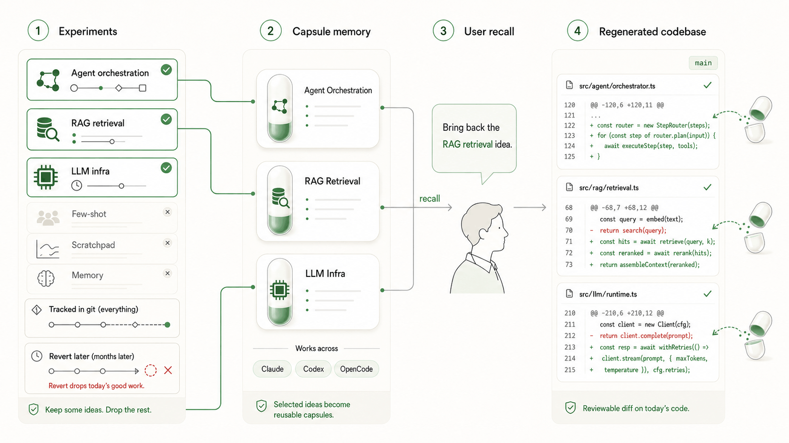
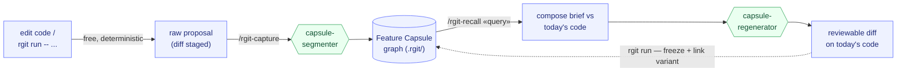

<h1 align="center">research-git</h1>

<p align="center">
  <strong>Capture a code idea as a clean semantic unit — regenerate it onto today's codebase.</strong>
  <br />
  <em>Works with Claude Code, and any MCP-capable client (Codex, GPT, …).</em>
</p>

<p align="center">
  <a href="#-quick-start"></a>
  
  
  
</p>

<p align="center">
  <strong>Git recovers history. It can't recover an entangled idea onto today's code.</strong>
</p>

<p align="center">
  
</p>

research-git captures experiments as Feature Capsules, then regenerates the one you need onto your current agent, using your existing Coding Plan subscription, no pay-per-use API.

> **Think of it as Git for agentic coding experiments: not just recovering old code, but bringing old ideas back into today’s code.**

---

## How it works

One loop: capture each idea into a graph, then regenerate it onto today's code. The engine (blue) is free and deterministic; intelligence happens at exactly two points (green) — subagents dispatched onto your existing subscription, never a paid API.



---

## The Feature Capsule

Every idea you keep becomes one capsule — a self-contained unit a future agent can read and bring back:

| Field | What it holds |
|-------|---------------|
| **intent** | why this change existed — the hypothesis, not a diff restatement |
| **code slices** | the relevant snippets / files / symbols |
| **knobs** | parameters / flags / configs |
| **dependencies** | other capsules it needs + silent assumptions |
| **result** | metrics / notes / why it worked or didn't, linked to the runs it produced |
| **resurrection guide** | how to regenerate it onto a changed codebase |

Capsules live in a small graph beside your repo (`.rgit/`), on top of normal git. Every run you launch through research-git also freezes a **byte-exact, content-addressed snapshot** of the code that ran — so "the code behind this result" is always a perfect replay, never at the mercy of an agent.

---

## 🚀 Quick Start

Five steps: install → init → run → capture → recall.

### 1. Install

```bash
pip install research-git        # or, from a clone: pip install -e .

# wire the plugin (agents + skills) and the MCP server into your client
rgit install                    # auto-detects every agent client on this machine and wires them all
rgit install claude-code        # or pick one explicitly (claude-code / codex / gemini / opencode / generic)
rgit install --list             # list platforms; --uninstall to remove
```

`codex`, `gemini`, and `opencode` share the `~/.agents/skills/` convention — the installer symlinks each skill there and prints the one-line MCP server entry to drop into that client's config. It also writes a managed research-git guidance block into the client's global guidance file when the platform has one (`~/.codex/AGENTS.md`, `~/.claude/CLAUDE.md`, or `~/.gemini/GEMINI.md`). On an interactive terminal you're asked how proactive capture should be — `default`, `manual-only`, or `none`; pass `--guidance <mode>` to choose non-interactively. Start a new agent session after install so the guidance is loaded. Prefer the manual route on Claude Code? `/plugin marketplace add StepzeroLab/research-git` then `/plugin install research-git@research-git`.

### 2. Initialize in your repo

```bash
cd your-project
rgit init                       # creates .rgit/ (the store) at the git root
```

**Optional — capture on every commit.** `rgit install <platform>` wires the agent side only; it deliberately does **not** touch your git hooks. If you also want every `git commit` to stage its own diff as a pending proposal automatically, opt in with:

```bash
rgit install-hooks              # adds a post-commit hook (never clobbers an existing one)
```

Good fit: solo research repos where you want nothing to slip through, even when you forget to capture. Skip it if the repo already has its own post-commit hook (the installer refuses to touch foreign hooks, so nothing breaks — it just won't install), if your team prefers deliberate manual capture, or in CI/shared clones where commit-time side effects are unwelcome. Without hooks you lose nothing: bare `rgit capture` takes the last commit when the tree is clean, `rgit capture A..B` a whole span, and `rgit review` is the gate either way — hooks only stage proposals, they never approve anything. Remove with `rgit install-hooks --uninstall`.

### 3. Run a variation and capture the idea

Launch your work through `rgit run` — it executes your command, freezes a reproducible artifact, records the run + any metrics, and stages what changed:

```bash
rgit run -- python eval_agent.py --retrieval rerank
```

Then turn that raw material into a clean capsule (in a Claude Code session):

```
/rgit-capture            # segments the diff into Feature Capsules, then wires up graph edges
rgit review              # list proposals
rgit review --approve <proposal_id> --name rerank-retrieval
```

Committed before capturing? Just run `rgit capture` — on a clean tree it captures the last commit (and says which one); `rgit capture main..HEAD` takes a whole span. (With the optional post-commit hook installed, every commit stages itself automatically.)

### 4. Bring an idea back onto today's code

Weeks later, after the agent has moved on:

```
/rgit-recall  bring back the re-ranking retrieval step
```

Recall scores capsules against your query, surfaces each hit with its related neighbors, then dispatches a subagent that *re-implements* the idea onto today's structure — adapting to refactors and leaving you a reviewable diff.

That's the whole loop. The rest of the commands you'll meet as you need them — see [More commands](#more-commands).

---

## Updating

```bash
rgit update
```

Upgrades the package (via whichever of uv/pipx/pip installed it) and refreshes every installed platform surface: the Claude Code plugin copy, MCP config, and the managed guidance blocks. Guidance blocks you have customized or removed are left alone — the command tells you how to restore them instead.

rgit checks PyPI for a newer release at most once a day (in the background, terminal sessions only). Once one is found, it prints a one-line upgrade notice after every qualifying command until you upgrade or turn the notice off — the check is throttled, the reminder is not. Silence it for good with `rgit update --off`, or per-environment with `RGIT_UPDATE_CHECK=0`.

---

## 🧩 Where it fits

Anywhere you try many variations of one thing and later want a single one back — cleanly, on top of how the code looks now.

- 🤖 **Agent / Prompt engineering** — you tried four prompt structures, two tool-splitting schemes, and a different retrieval step. Last week's version scored better; bring *that* idea back onto the agent you've since rewritten.
- ⚙️ **Backend / Systems** — three caching strategies, two rate-limiters, a reworked query plan. Which won? Pull the winning variant forward without reverting everything built since.
- 🎨 **Frontend** — competing interaction flows and layout variants, half commented out. Resurrect the one that tested best onto the current component tree.

Also at home in ML research — different loss terms, attention blocks, augmentations. Same shape: the experiment is the idea, the metrics are the result, and you want one variant back on today's code.

---

## 🤝 Share the memory with your team

The graph is served over MCP **read-only** (`recall` / `compose` / `get`, plus the query commands `compare` / `ablation` / `provenance`). Point a teammate's client at your `rgit mcp` server and they get the same Feature Capsules and the same answers — then *their* session regenerates an idea onto *their* code, on *their* subscription. The memory is shared; the intelligence is local.

---

## 🔧 Under the Hood

### Build the memory, borrow the agent

The engine owns the durable, deterministic parts — the graph, content-addressed object store, git diffing, and the byte-exact run freeze. The agentic parts are delegated to subagents the host already provides. We don't reimplement an agent loop, and we never call a paid API.

### Two-phase capture

A free, deterministic Phase 1 (`libcst` maps diff hunks to the functions/classes they touch) produces a rough candidate for every change. Phase 2 is a dispatched `capsule-segmenter` subagent that clusters the diff into coherent features, drops infrastructure noise, and writes the real intent, knobs, assumptions, and resurrection guide. Once a capsule is approved, the engine deterministically links same-region edges and over-produces `depends_on` candidates from name overlap, which an `edge-judge` subagent confirms or rejects.

### Ranked, edge-aware recall

Recall scores every approved capsule against your query in plain Python — no embeddings, no SQL `LIKE` traps — and boosts a hit when a connected capsule also matches, so related work surfaces together. Each result carries its related subgraph.

### Two planes

- **MCP — shared memory (query-only).** Returns graph snippets; safe to expose so a team shares one memory. Carries no intelligence.
- **Plugin — local intelligence.** Three subagents (`capsule-segmenter`, `capsule-regenerator`, `edge-judge`) and two skills (`rgit-capture`, `rgit-recall`) define *how* a session acts on those snippets, natively, on its own subscription.

### Reproducibility contract

The agent helps you *author*; it is never in the *replay* path. `rgit run` freezes the exact bytes that ran, content-addressed and immutable. "The code behind run X" is a byte-identical re-materialization of a stored blob.

---

## More commands

The five-step loop above is the core. These show up as your store grows — run `rgit <command> --help` for any of them:

| Command | What it does |
|---------|--------------|
| `rgit watch` | free, deterministic background capture — stages raw material as you edit, so fleeting in-between states aren't lost |
| `rgit capture [REV \| A..B]` | bare: auto-picks the working tree or, when clean, the last commit; pass a commit or an A..B range for precise control |
| `rgit install-hooks` | opt-in: stage every commit's diff via a post-commit hook (not installed by `rgit install`; won't touch an existing hook) — see step 2 above |
| `rgit run --from <capsule>` | run a recalled variant and link the new run as a `variant_of` the original |
| `rgit compare <query>` | which variant won: ranked table, Δ vs baseline, ★ winner |
| `rgit provenance <run_id>` | per-feature clean (capsule) vs agent-adapted (frozen) diff for a run |
| `rgit mcp` | serve the graph read-only so a teammate's client can recall against it |

---

## License

<p align="center">
  <strong>MIT</strong> © Stepzero Lab
  <br />
  <sub>Core contributors: Yuxiang Lin · Fengrong Wan · Jiajun Sun</sub>
</p>
